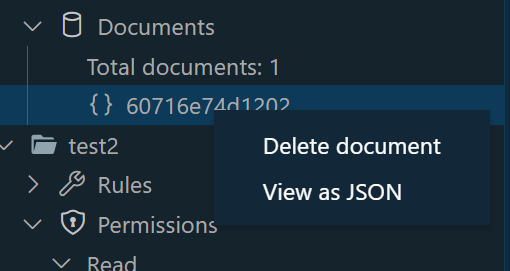
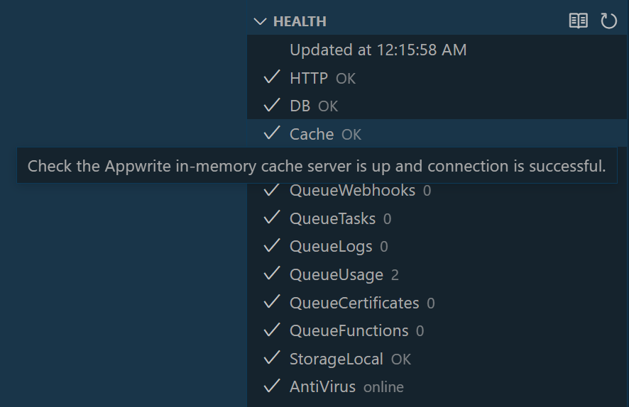

# Appwrite for Visual Studio Code

Use the Appwrite extension to quickly monitor, manage, and interact with your Appwrite instance directly from VS Code.

## What is Appwrite?

From [appwrite.io](https://appwrite.io)

> Secure Open-Source Backend Server for Web, Mobile & Flutter Developers
>
> Appwrite is a self-hosted solution that provides developers with a set of easy-to-use and integrate REST APIs to manage their core backend needs.

## Features

### View database documents right inside VS Code.



### Manage database collection permissions and rules.


### Create and view users, user preferences, and more.


### Quickly and easily check the health of all the Appwrite services.



## Requirements

This extension does not provide features for setting up or installing Appwrite. Only managing and interacting with Appwrite once it's running.

## Extension Settings

Include if your extension adds any VS Code settings through the `contributes.configuration` extension point.

For example:

This extension contributes the following settings:

* `appwrite.projects`: List of Appwrite project configurations. To set up a project configuration, run the `Connect to Appwrite` command. Search commands by hitting <kbd>F1</kbd>, then search `Connect to Appwrite`.

After connecting to an Appwrite project, your `appwrite.projects` setting will contain:

```json
{
            "endpoint": "https://[Domain]/v1",
            "projectId": "[Project ID]",
            "secret": "API key with all scopes",
            "nickname": "My project"
}
```

We plan on adding better multi-project support in the future.

## Known Issues

If you find issues, or want to suggest features, please file them in the issues section of the repository.

### 1.0.0

Initial release of the Appwrite extension for VS Code.

The initial release only includes features for Database, Users, and Health Appwrite APIs. However support for Storage and Functions APIs is on the way.


-----------------------------------------------------------------------------------------------------------
## Following extension guidelines

Ensure that you've read through the extensions guidelines and follow the best practices for creating your extension.

* [Extension Guidelines](https://code.visualstudio.com/api/references/extension-guidelines)

## Working with Markdown

**Note:** You can author your README using Visual Studio Code.  Here are some useful editor keyboard shortcuts:

* Split the editor (`Cmd+\` on macOS or `Ctrl+\` on Windows and Linux)
* Toggle preview (`Shift+CMD+V` on macOS or `Shift+Ctrl+V` on Windows and Linux)
* Press `Ctrl+Space` (Windows, Linux) or `Cmd+Space` (macOS) to see a list of Markdown snippets

### For more information

* [Visual Studio Code's Markdown Support](http://code.visualstudio.com/docs/languages/markdown)
* [Markdown Syntax Reference](https://help.github.com/articles/markdown-basics/)

**Enjoy!**
